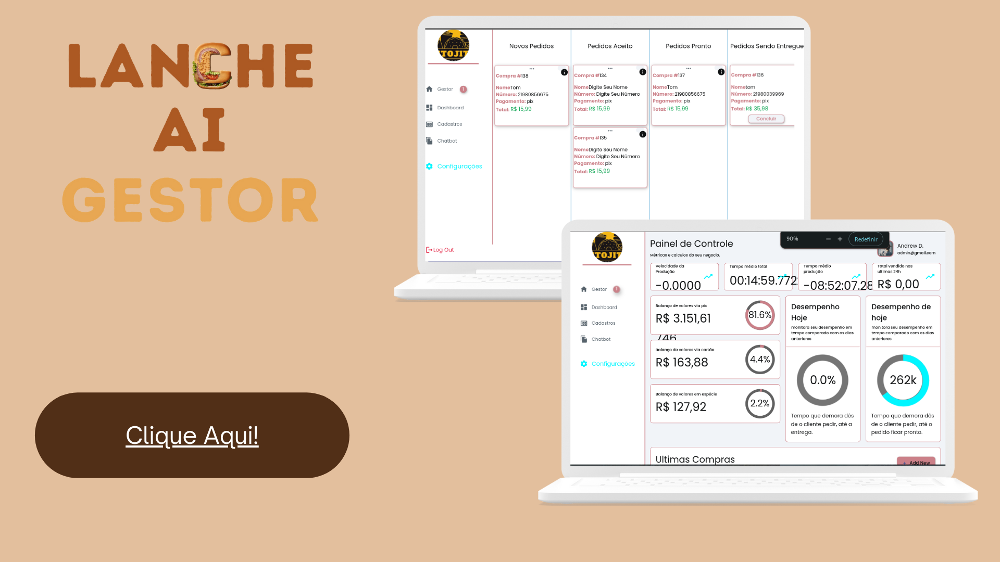

# Lanche Ai - Frontend

O Lanche Ai é um sistema completo de gestão de pedidos, desenvolvido para otimizar o processo de vendas e atendimento ao cliente. Este repositório contém o frontend do projeto, implementado em Dart no framework flutter, com conexões dinâmicas ao banco de dados Supabase e integração com o backend.

## Tecnologias Utilizadas

- **Dart**: Linguagem de programação utilizada para o desenvolvimento do frontend.
- **Flutter**: Framework utilizado para a criação de interfaces nativas para dispositivos móveis.
- **Supabase**: Plataforma de banco de dados que oferece funcionalidades como autenticação, armazenamento de dados e APIs em tempo real.
- **PostgreSQL**: Banco de dados relacional utilizado para armazenar e gerenciar informações.
- **Cloud Functions**: Utilizadas para criar funções personalizadas e automatizar processos no backend.

## Funcionalidades Principais

### Conexão Dinâmica com o Banco de Dados

- **Supabase**: Integração direta com o banco de dados Supabase para armazenar e recuperar informações em tempo real.
- **Funções PostgreSQL**: Utilizadas para executar operações complexas no banco de dados de forma eficiente.

### Integração com o Backend

- **Cloud Maps**: Ferramenta utilizada para acessar e interagir com o backend, garantindo uma comunicação fluida entre o frontend e o backend.
- **API do Mercado Pago**: Implementação de pagamentos via Pix, permitindo transações seguras e rápidas.

### Interface do Usuário

- **Design Responsivo**: Interfaces otimizadas para diferentes dispositivos, proporcionando uma experiência de usuário consistente.
- **Chatbot Inteligente**: Implementação de um chatbot para auxiliar nas vendas e na gestão de pedidos, oferecendo suporte rápido e eficiente aos clientes.

## Estrutura do Projeto

Para acessar o repositório do frontend do projeto Lanche Ai, visite: [Lanche Ai Frontend](https://github.com/criptenor/Lanche-Ai-backend.git)

